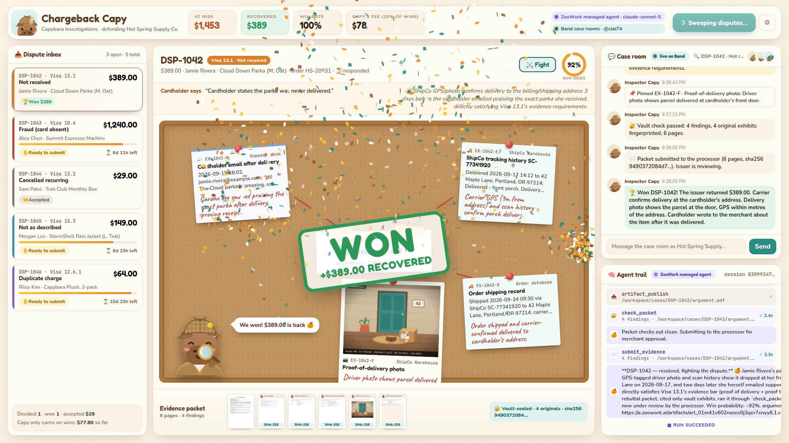

# 🔍 Chargeback Capy

**An AI chargeback detective for online merchants.** Inspector Capy (a capybara in a deerstalker)
investigates every card dispute, gathers evidence from the merchant's systems and partner companies,
writes an evidence packet, and submits it once the merchant approves. Capy recommends a refund when
the merchant is actually at fault.

> Merchants pay **20% of recovered dollars only**. If Capy doesn't win, it doesn't earn.

Built for the AI Commerce hackathon on **ZooWork managed agents** and **Band**.



## Why merchants would pay

- **The money is already lost.** A chargeback costs the sale, the goods and a dispute fee. Anything
  recovered is pure upside, and chargeback services are commonly paid a share of what they win back.
- **Small shops rarely fight back.** Evidence is scattered across orders, carriers, support inboxes and
  suppliers; deadlines are days, and every reason code has its own rules. That is multi-step agent work.
- **The networks reward evidence.** For example, Visa's Compelling Evidence 3.0 lets merchants win some
  fraud disputes with prior undisputed orders from the same device or address. Capy checks this
  automatically.

## What happens in a sweep

Hot Spring Supply Co. (fictional) has five open Visa disputes, $1,871 at risk:

| Dispute | Reason | What Capy does | Outcome |
|---|---|---|---|
| DSP-1042 · $389 | 13.1 Not received | Asks the **ShipCo warehouse agent** on Band for the GPS-stamped driver photo; finds the cardholder's email asking for another colour two days after delivery | Won |
| DSP-1043 · $1,240 | 10.4 Fraud | Two prior undisputed orders share device and address (Visa CE 3.0); ShipCo confirms the signature | Won |
| DSP-1044 · $29 | 13.2 Cancelled recurring | Billing log shows the customer cancelled before renewal (our sync bug) → **recommends a refund** | Accepted |
| DSP-1045 · $149 | 13.3 Not as described | Asks **the merchant** in the Band room for the ISO 811 lab report proving the jacket is waterproof | Won |
| DSP-1046 · $64 | 12.6.1 Duplicate | The duplicate charge was refunded before the dispute (ARN on file) | Won |

The live ZooWork agent makes these calls itself; nothing above is hard-coded into its prompt.

## How it works

```
 Merchant systems ──custom tools──▶  ZooWork managed agent  ◀──@mentions──▶  Band case rooms
 (orders, payments,                  "Inspector Capy"                       (ShipCo warehouse agent,
  support, billing)                  one session per dispute                 the merchant, audit trail)
                                     sandbox writes the PDF
                                     always_ask before money moves
                                              │
                         Evidence vault ◀─────┘────▶ Card processor (simulated issuer)
                         originals + SHA-256          rules by reason-code evidence
```

### ZooWork: the agent runtime
- **Managed agent** `inspector-capy` (Claude Sonnet 5 via ZooWork) with persona docs (`backend/capy/persona/`).
- **One session per dispute**, all five in parallel; every event is streamed into the dashboard's *Agent trail*.
- **13 application-executed custom tools** (`backend/capy/tools.py`). Merchant data and credentials stay in
  our backend; nothing secret enters the sandbox.
- **Sandbox work**: Capy writes a reportlab script, runs it with `exec`, and publishes `argument.pdf` with
  `artifact_publish`; our backend downloads the artifact for the vault check.
- **`always_ask` permission** on `submit_evidence` and `accept_dispute`: the run pauses on ZooWork's approval
  gate until the merchant clicks Approve in the dashboard (`agent.approval` → `resolve_approval`).
- **Replayable trajectories**: each dispute ends in a business outcome (won / lost / accepted), which is
  exactly the labelled trajectory ZooWork's evaluation pitch is about. Every sweep is also recorded to
  `backend/runs/` and can be replayed from the dashboard.

### Band: the collaboration network
- Registers two external agents with the merchant's key: **Inspector Capy** and **ShipCo Warehouse**
  (a fulfilment partner). Both connect over Band's WebSocket through the Band SDK.
- **One Band room per dispute** with a goal on the room board. Capy recruits ShipCo into the room only when
  it needs delivery evidence (dynamic participants), and ShipCo replies by @mention.
- **The merchant is a human participant.** Capy's questions are Band *attention* items; the merchant can answer
  in Band itself or from the dashboard (posted to Band as the merchant).
- Every step (pins, strategy, vault checks, submissions, rulings) is posted to the room, giving a
  cross-company audit trail.

### The evidence vault: no source, no claim
Every fact a tool returns becomes an exhibit (`EX-1042-F`) with a SHA-256 fingerprint. Capy's findings must
cite exhibit ids; `check_packet` rejects any claim without one. The vault then appends the **original**
exhibits, untouched, behind Capy's argument. The AI writes the argument but never touches the evidence.

### Simulated pieces (by design)
- The merchant, its orders and the five disputes are fictional (`backend/capy/world.py`).
- The card processor/issuer is simulated: it rules in seconds using simplified per-reason-code evidence
  rules (`backend/capy/processor.py`). Real issuers take weeks.
- ShipCo's agent runs in our process (same Band owner) with a deterministic evidence desk.

## Run it

Prerequisites: Python 3.11+ with [uv](https://docs.astral.sh/uv/), Node 22+.

```bash
cp .env.example .env            # add your keys (all optional, see below)

cd frontend && npm install && npm run build && cd ..
cd backend && uv sync
uv run uvicorn capy.server:app --port 8000
# open http://localhost:8000 and click "Run dispute sweep"
```

For frontend development, run `npm run dev` in `frontend/` (port 5173, proxies to the backend).

| Key | What it enables | Without it |
|---|---|---|
| `ZOOWORK_API_KEY` | Inspector Capy runs as a ZooWork managed agent | A scripted inspector drives the same tools |
| `BAND_API_KEY` (user key) | Real Band case rooms, ShipCo agent, merchant on Band | Case rooms run locally in the dashboard |
| `ELEVENLABS_API_KEY` | Demo video narration, music and sound effects | Video can be rendered `--silent` with captions |

Optional settings: `ZOOWORK_MODEL` (default `litellm/claude-sonnet-5`), `CAPY_ZOOWORK` / `CAPY_BAND`
(`auto` | `on` | `off`), `CAPY_PACE` (scripted-inspector speed), `CAPY_ISSUER_DELAY` (seconds).

The ⚙ menu next to *Run dispute sweep* chooses ZooWork or the scripted inspector, toggles Band, and replays
recorded sweeps. If ZooWork fails (for example, no credits), the scripted inspector takes over that case and
a warning toast says so.

Tests: `cd backend && uv run pytest`.

## Live demo script (3 minutes)

1. **Problem (20s).** "Chargebacks drain small shops: scattered evidence, short deadlines, friendly fraud."
2. **Run sweep.** Five Visa disputes light up; the Agent trail shows five parallel ZooWork sessions.
3. **DSP-1042.** In the Band case room, ShipCo's agent returns the driver photo; the board fills with pinned
   evidence and red string.
4. **DSP-1045.** Capy asks you for the lab report → click **📎 Share** (or answer in the Band app).
5. **DSP-1044.** The refund approval appears: "Honest call: this one is on us." Approve.
6. **DSP-1042 approval.** Show the packet: argument, then vault-sealed originals (click the photo page). Approve.
   **WON** stamp, confetti, recovered ticker.
7. **Close** on KPIs: $1,842 recovered, 100% win rate, Capy's fee only on wins. Open the Band app to show
   the real rooms.

## Demo video

`video/make_video.py` records the real dashboard during a live sweep on a virtual display, then mixes
ElevenLabs narration (Jessica as narrator, George as Inspector Capy), ElevenLabs sound effects and an
ElevenLabs music bed:

```bash
Xvfb :99 -screen 0 1920x1200x24 &
cd video && DISPLAY=:99 uv run --project ../backend --with playwright python make_video.py
# → video/out/chargeback-capy.mp4    (--brain scripted for an offline take, --silent without ElevenLabs)
```

## Layout

```
backend/capy/      world, vault, processor, tools, Band rooms, ZooWork runner, scripted inspector, API
backend/capy/persona/   Inspector Capy's ZooWork persona docs (operating manual, identity, soul)
backend/capy/assets/    exhibit artwork (SVG → PNG), fonts (OFL)
frontend/src/      React dashboard: inbox, corkboard, Band room, agent trail, approvals, story cards
video/             narration script and recorder
```
